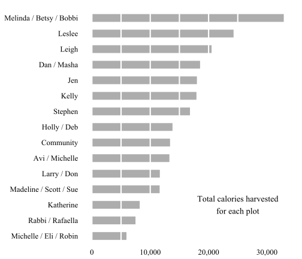

## 2016 overall results

We had great results again in 2016! 

We are on track for a great harvest again in 2016, even more than [close to 2015, which was the previous highest yield ever](http://sgaul.github.io/peah2015/).    

While we are still harvesting, gardeners so far have distributed 2,400 pounds of vegetables or about 235,000 calories - roughly three months of food for an adult. This is on track with last year's totals, which were the previous highest ever.


<div id = 'chart1' class = 'rChart nvd3'></div>
<script type='text/javascript'>
 $(document).ready(function(){
      drawchart1()
    });
    function drawchart1(){  
      var opts = {
 "dom": "chart1",
"width":    500,
"height":    300,
"x": "Year",
"y": "Calories",
"type": "discreteBarChart",
"id": "chart1" 
},
        data = [
 {
 "Year": 2002,
"Pounds":        1273.25,
"Calories": 114403.9329167 
},
{
 "Year": 2003,
"Pounds":          778.5,
"Calories":       86920.57 
},
{
 "Year": 2004,
"Pounds":        1302.25,
"Calories":      140183.85 
},
{
 "Year": 2005,
"Pounds":         1392.5,
"Calories":      151554.28 
},
{
 "Year": 2006,
"Pounds":        1321.25,
"Calories":     134382.865 
},
{
 "Year": 2007,
"Pounds":        1686.25,
"Calories":  153063.073334 
},
{
 "Year": 2008,
"Pounds":            898,
"Calories":    90317.34125 
},
{
 "Year": 2009,
"Pounds":           1028,
"Calories": 100385.8316667 
},
{
 "Year": 2010,
"Pounds":         911.75,
"Calories":      84708.455 
},
{
 "Year": 2011,
"Pounds":           1269,
"Calories":      147313.92 
},
{
 "Year": 2012,
"Pounds":        1901.23,
"Calories":    164506.3552 
},
{
 "Year": 2013,
"Pounds":            608,
"Calories":      67887.755 
},
{
 "Year": 2014,
"Pounds":           2634,
"Calories":      260500.66 
},
{
 "Year": 2015,
"Pounds":        2580.35,
"Calories":     240780.035 
} 
]
  
      if(!(opts.type==="pieChart" || opts.type==="sparklinePlus" || opts.type==="bulletChart")) {
        var data = d3.nest()
          .key(function(d){
            //return opts.group === undefined ? 'main' : d[opts.group]
            //instead of main would think a better default is opts.x
            return opts.group === undefined ? opts.y : d[opts.group];
          })
          .entries(data);
      }
      
      if (opts.disabled != undefined){
        data.map(function(d, i){
          d.disabled = opts.disabled[i]
        })
      }
      
      nv.addGraph(function() {
        var chart = nv.models[opts.type]()
          .width(opts.width)
          .height(opts.height)
          
        if (opts.type != "bulletChart"){
          chart
            .x(function(d) { return d[opts.x] })
            .y(function(d) { return d[opts.y] })
        }
          
         
        chart
  .forceY([      0, 1.7e+05 ])
  .margin({
 "left":     80 
})
          
        chart.xAxis
  .axisLabel("Year")

        
        
        chart.yAxis
  .tickFormat(function(d) {return d3.format(',.0f')(d)})
  .axisLabel("Calories")
      
       d3.select("#" + opts.id)
        .append('svg')
        .datum(data)
        .transition().duration(500)
        .call(chart);

       nv.utils.windowResize(chart.update);
       return chart;
      });
    };
</script>

Here is the same result in pounds harvested. 


<div id = 'chart2' class = 'rChart nvd3'></div>
<script type='text/javascript'>
 $(document).ready(function(){
      drawchart2()
    });
    function drawchart2(){  
      var opts = {
 "dom": "chart2",
"width":    500,
"height":    300,
"x": "Year",
"y": "Pounds",
"type": "discreteBarChart",
"id": "chart2" 
},
        data = [
 {
 "Year": 2002,
"Pounds":        1273.25,
"Calories": 114403.9329167 
},
{
 "Year": 2003,
"Pounds":          778.5,
"Calories":       86920.57 
},
{
 "Year": 2004,
"Pounds":        1302.25,
"Calories":      140183.85 
},
{
 "Year": 2005,
"Pounds":         1392.5,
"Calories":      151554.28 
},
{
 "Year": 2006,
"Pounds":        1321.25,
"Calories":     134382.865 
},
{
 "Year": 2007,
"Pounds":        1686.25,
"Calories":  153063.073334 
},
{
 "Year": 2008,
"Pounds":            898,
"Calories":    90317.34125 
},
{
 "Year": 2009,
"Pounds":           1028,
"Calories": 100385.8316667 
},
{
 "Year": 2010,
"Pounds":         911.75,
"Calories":      84708.455 
},
{
 "Year": 2011,
"Pounds":           1269,
"Calories":      147313.92 
},
{
 "Year": 2012,
"Pounds":        1901.23,
"Calories":    164506.3552 
},
{
 "Year": 2013,
"Pounds":            608,
"Calories":      67887.755 
},
{
 "Year": 2014,
"Pounds":           2634,
"Calories":      260500.66 
},
{
 "Year": 2015,
"Pounds":        2580.35,
"Calories":     240780.035 
} 
]
  
      if(!(opts.type==="pieChart" || opts.type==="sparklinePlus" || opts.type==="bulletChart")) {
        var data = d3.nest()
          .key(function(d){
            //return opts.group === undefined ? 'main' : d[opts.group]
            //instead of main would think a better default is opts.x
            return opts.group === undefined ? opts.y : d[opts.group];
          })
          .entries(data);
      }
      
      if (opts.disabled != undefined){
        data.map(function(d, i){
          d.disabled = opts.disabled[i]
        })
      }
      
      nv.addGraph(function() {
        var chart = nv.models[opts.type]()
          .width(opts.width)
          .height(opts.height)
          
        if (opts.type != "bulletChart"){
          chart
            .x(function(d) { return d[opts.x] })
            .y(function(d) { return d[opts.y] })
        }
          
         
        chart
  .forceY([      0,   1700 ])
  .margin({
 "left":     80 
})
          
        chart.xAxis
  .axisLabel("Year")

        
        
        chart.yAxis
  .tickFormat(function(d) {return d3.format(',.0f')(d)})
  .axisLabel("Pounds")
      
       d3.select("#" + opts.id)
        .append('svg')
        .datum(data)
        .transition().duration(500)
        .call(chart);

       nv.utils.windowResize(chart.update);
       return chart;
      });
    };
</script>

## 2016 individual results

We distributed 29 different kinds of vegetables this year - more than most years - with tomatoes, zucchini andsquash yielding the most (over 250 lbs of each). 

 

The results by calories are similar, with a couple of high-calorie crops like beets and kale having more of an impact: 

 

The results by plot are here - congratulations to Melinda, Betsy, Bobbi and everyone else that made this such a great year!

 

Individual results for the year are listed in the table below. 

<!-- html table generated in R 3.2.1 by xtable 1.7-4 package -->
<!-- Sat Oct 29 23:18:48 2016 -->
<table border=1>
<tr> <th> Plot.number </th> <th> Year </th> <th> Month </th> <th> Date </th> <th> Number.of.plots </th> <th> Crop </th> <th> Variety </th> <th> Pounds </th> <th> Pounds.per.plot </th> <th> Calories </th> <th> Calories.per.plot </th> <th> Name </th>  </tr>
  </table>

The full data for all years can be found [here](https://docs.google.com/spreadsheet/ccc?key=0AlYsW526rxsmdDhIVzM0VDYzRkdLOXlvcldfQkJtcnc&usp=sharing). 

## Comparison with prior years

We had good results for virtually everything we planted and very good yields for kale, zucchini and tomatoes. Results for most other crops were above average. 

 

Why else did things go so well this year? 

Like last yera, we had more harvests from the garden than any prior year. Gardeners have harvested more than 450 times to date. Last year, we harvested around 400 times and no other prior year had more than 250 harvests. (This may be partly due to better reporting on harvests in the last few years.)

 

During the year, the most intense periods were at the end of June and July - gardeners harvested more than 250 pounds during each of these weeks. 

 

We harvested crops by far the most often on Sunday, and least often on Saturdays and Mondays. (Saturday visits may be after sundown or data entry errors on my part.)


```
Error in eval(expr, envir, enclos): object 'visits' not found
```

When are various crops harvested? The charts below show the weekly harvests by crop for the past several years. Crops like beans and lettuce are harvested early, tomatoes and peppers later in the year and squash, collards and kale for longer periods. 

 

